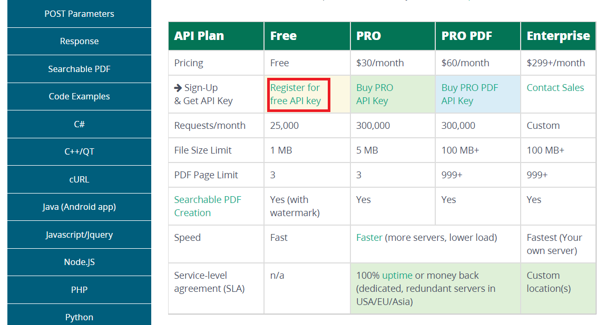
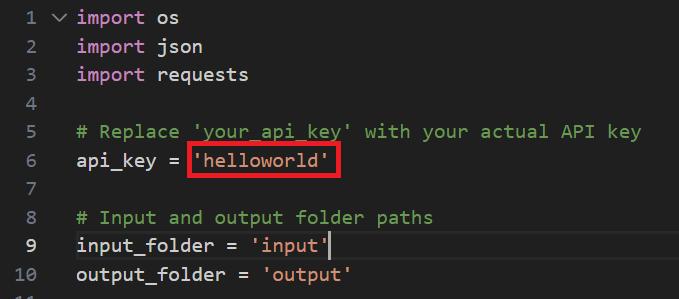

# TextVisionOCR

## Repo Structure

```
    ├── docs                                   # Contains documents.
    ├── research                               # Contains pre-research experiments.
    ├── source                                 # Contains project source code.
    │   ├── main.py                                # main file.
    └── README.MD                              # Readme Content.
```

## 01 Introduction

An automatic images-to-text converter, this cutting-edge tool simplifies the complex data extraction process, providing a seamless and accelerated workflow. With its powerful capabilities, this solution streamlines image-to-text conversion, boosting productivity and facilitating data retrieval. Additionally, this tool excels in efficiently processing bulk images, making it an ideal choice for handling large quantities of data. It's important to note that the system utilizes an online OCR API, which drives its optimal performance with advanced technology.


## 02 Technology Stack

- Python
- OCR API


## 03 Setup

### 3.1 Step 01: Download & Install Python

Download Link: https://www.python.org/


### 3.2 Step 02: Create an API Key

API Provider Link: https://ocr.space/



**NOTE:** This provider offers 25000 API calls per month.

### 3.3 Step 02: Replace your API Key



**NOTE:** If you don't want to create an API Key, you can still use the "helloworld" as your default API key; that is only for testing and will be experienced once you hit the trailing limit.

## 04 Usage

- **Source Directory: Execute the main.py**

  ```
  text-vision-ocr\source\main.py
  ```

- **Execution Command**

  ```
  python main.py
  ```

### 4.2 Output

[3-demo-video.webm](https://github.com/gunarakulangunaretnam/text-vision-ocr/assets/45822509/c8b1f634-1b0a-40f9-8b1b-5beeef699116)

## Social Links

- [Linkedin Profile](https://www.linkedin.com/in/gunarakulangunaretnam)
- [Facebook Profile](https://www.facebook.com/gunarakulangunaratnam)
- [Instagram Profile](https://www.instagram.com/gunarakulangunaretnam)
- [Twitter Profile ](https://twitter.com/gunarakulangr)
- [Kaggle Profile](https://www.kaggle.com/gunarakulangr)
- [TikTok Profile](https://www.tiktok.com/@gunarakulangunaretnam)
- [Youtube Profile](https://www.youtube.com/channel/UCMWkED5sabgVZSCKjZuRJXA)
